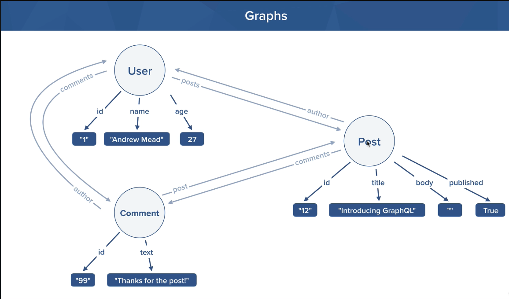

# GraphQL Basics

## Topics

* Queries
* GraphQL Scalar Types
* Live Reload
* PlayGround
* Custom Types
* Arguments
* Arrays
* Relational Data

## Schema Structure



## Code

``` javascript
import { GraphQLServer } from 'graphql-yoga';

const users = [
  {
    id: '1',
    name: 'Facu',
    email: 'a1gmail.com',
    age: 24,
  },
  {
    id: '2',
    name: 'Juan',
    email: 'Juan@gmail.com',
  },
  {
    id: '3',
    name: 'Maria',
    email: 'maria@gmail.com',
  },
];

const posts = [
  {
    id: '1',
    title: 'Welcome',
    body: 'hello',
    published: false,
    author: '1',
  },
  {
    id: '2',
    title: 'Hi',
    body: 'how are you?',
    published: false,
    author: '2',
  },
];

const comments = [
  {
    id: '1',
    text: 'Good post',
    author: '1',
    post: '1',
  },
  {
    id: '2',
    text: 'Awesome',
    author: '1',
    post: '1',
  },
  {
    id: '3',
    text: 'It does not like me',
    author: '2',
    post: '1',
  },
  {
    id: '4',
    text: 'Great, congrats!',
    author: '3',
    post: '2',
  },
];

const typeDefs = `
  type Query {
    users(query: String): [User!]!
    posts(query: String): [Post!]!
    comments(query: String): [Comment!]!
  }
  type User {
    id: ID!
    name: String!
    email: String!
    age: Int
    posts: [Post!]!
    comments: [Comment!]!
  }
  type Post {
    id: ID!
    title: String!
    body: String!
    published: Boolean!
    author: User!
    comments: [Comment!]!
  }
  type Comment {
    id: ID!
    text: String!
    author: User!
    post: Post!
  }
`;
const resolvers = {
  Query: {
    posts(parent, args, ctx, info) {
      if (!args.query) {
        return posts;
      } else {
        return posts.filter((post) => post.title.toLowerCase().includes(args.query.toLowerCase()));
      }
    },
    users(parent, args, ctx, info) {
      if (!args.query) {
        return users;
      } else {
        return users.filter((user) => user.name.toLowerCase().includes(args.query.toLowerCase()));
      }
    },
    comments(parent, args, ctx, info) {
      if (!args.query) {
        return comments;
      } else {
        return comments.filter((comment) => comment.text.toLowerCase().includes(args.query.toLowerCase()));
      }
    },
  },
  Post: {
    author(parent, args, ctx, info) {
      return users.find((user) => user.id === parent.author);
    },
    comments(parent, args, ctx, info) {
      return comments.filter((comment) => comment.author === parent.id);
    },
  },
  User: {
    posts(parent, args, ctx, info) {
      return posts.filter((post) => post.author === parent.id);
    },
    comments(parent, args, ctx, info) {
      return comments.filter((comment) => comment.author === parent.id);
    },
  },
  Comment: {
    author(parent, args, ctx, info) {
      return users.find((user) => user.id === parent.author);
    },
    post(parent, args, ctx, info) {
      return posts.find((post) => post.id === parent.post);
    },
  },
};

const server = new GraphQLServer({
  typeDefs,
  resolvers,
});

server.start(() => {
  console.log('Server Running');
});

```
